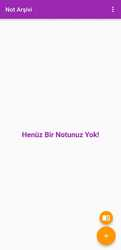
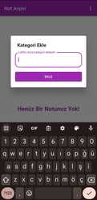
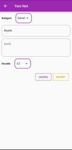
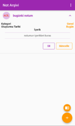
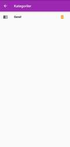
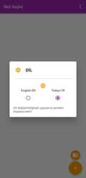

# ***Günlük Yapılacaklar Listesi***

  
<b> İngilizce Dil destekli Notlar uygulaması bize notlarımızı katagorilendirip, önem derecesine göre seviyelendirip kaydetmemizi sağlar</b>
  
-> Ana sayfadan not ekleyebilir,notları listeleyebilir, katagori ekleyip katagori listeleyebiliriz. 
-> Notlar ana sayfada önem seviyesini göre listelenir. 
-> Notları güncelle butonuyla güncelleyebiliriz! 
-> katagori yokken not eklemesi yapılmaya çalışıldığında önce sizden katagori eklemenizi isteyecektir! 

  

<h3>!!! DİKKAT !!!</h3>
Eğer bir kategoriyi silerseniz o katagoriye ait tüm notlar da silinecektir!!!

 
 

     
    
     
    
     
    
   
    

